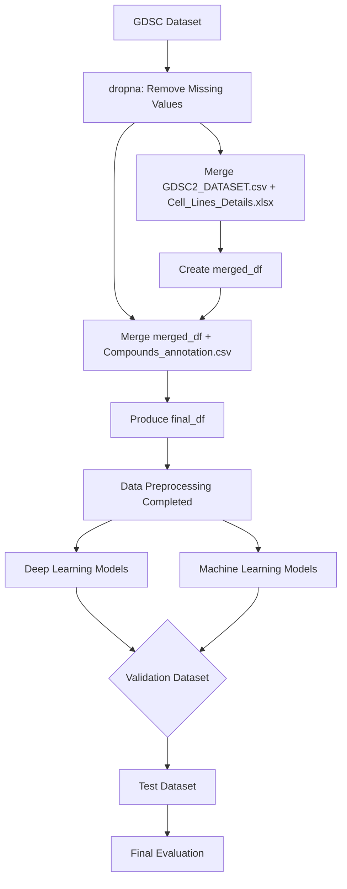

# Kaggle_Genomics-of-Drug-Sensitivity-in-Cancer
Dataset url : https://www.kaggle.com/datasets/samiraalipour/genomics-of-drug-sensitivity-in-cancer-gdsc/data

## Folder Architecture
```
Kaggle_Genomics-of-Drug-Sensitivity-in-Cancer/
│
├── README.md
├── DatasetEDA.py
├── LICENSE
├── __pycache__
│
├── BERT/
│   ├── __pycache__
│   ├── main.ipynb
│   ├── data_loader_BERT.py
│   ├── model.py
│   ├── config.py
│   └── utils.py
│
├── DL/
│   ├── __pycache__
│   ├── main_DL.py
│   ├── dataloader.py
│   ├── MLP.py
│   └── CNNTransformer.py
│
├── IMG/
│   ├── GDSC_col_boxplot.png
│   ├── Heatmap.png
│   ├── MSE.png
│   ├── ML_leaderboard.png
│   ├── DL_leaderboard.png
│   └── training_pipeline.png
│
└── ML/
    ├── __pycache__
    ├── main_ML.py
    ├── dataloader.py
    ├── ML_model.py
    └── tuning_log.md
```


## Introduction
The **Genomics of Drug Sensitivity in Cancer (GDSC)** project, a collaboration between the UK and USA, aims to systematically evaluate the sensitivity of human cancer cell lines to anti-cancer drugs. Key characteristics of the dataset include:  
- **Cell Viability Measurement**: Using the CellTiter-Glo assay after 72 hours of treatment.  
- **Target Variable**: `LN_IC50` – Represents the natural log of the drug concentration required to inhibit 50% of cell viability. Lower values indicate higher sensitivity to the drug.  

## Dataset Overview  

### Files Used  
- **GDSC2_DATASET.csv**: Drug sensitivity data for various cell lines.  
- **Cell_Lines_Details.xlsx**: Metadata for cancer cell lines.  
- **Compounds_annotation.csv**: Annotation details of the compounds used.  
- **GDSC_DATASET.csv**: Combined dataset merging the above three files.

## Dataset EDA
### GDSC_DATASET.csv
Origin: 242035 rows x 19 columns
#### Numerical Columns Analysis
* **LN_IC50**: The primary target variable.
* AUC
* Z_SCORE


This is the box plot of the 3 numerical columns. We could see that there are some outliers, so we removed the data outside the 3 times of IQR.
#### Categorical Columns Analysis
* Microsatellite instability Status (MSI)
* Screen Medium
* Growth Properties
* CNA
* Gene Expression
* Methylation

We mapped these columns form text categories to numbers.
#### Heatmap


## Data Preprocessing  

1. **Step 1: Handling Missing Values**  
   - Applied `dropna` to ensure data completeness.

2. **Step 2: First Merge**  
   - Merged `GDSC2_DATASET.csv` with `Cell_Lines_Details.xlsx` to form `merged_df`.

3. **Step 3: Second Merge**  
   - Merged `merged_df` with `Compounds_annotation.csv` to produce the final dataset: `final_df`.

## Pipeline



## Models Implemented  

### Machine Learning Models  
- **Linear Models**:  
  - Lasso Regression  
  - Ridge Regression  
  - ElasticNet Regression  
  - Linear Regression  

- **Decision Trees and Ensemble Models**:  
  - Decision Tree  
  - Random Forest  
  - HistGradientBoosting  
  - XGBoost  
  - LightGBM  

- **Instance-Based Learning**:  
  - K-Nearest Neighbors (KNN) Regression  

*Hyperparameters were optimized using GridSearchCV.*

### Deep Learning Models  
- **Multilayer Perceptron (MLP)**  
- **CNN + Transformer**  
- **BERT-based Models**:  
    - bert-base-uncased
    - roberta-base
    - microsoft/deberta-v3-base
    - microsoft/deberta-v3-large

---

## Evaluation
We use Mean Squared Error (MSE) as our performance metric.


## Experimental Record
### Machine Learning Model leaderboard
- the tuning log is in /ML/tuning_log.md


### Deep Learning Model leaderboard


---
### Contributors

<a href="https://github.com/andrew76214/Kaggle_Genomics-of-Drug-Sensitivity-in-Cancer/graphs/contributors">
  
</a>

Made with [contrib.rocks](https://contrib.rocks).
