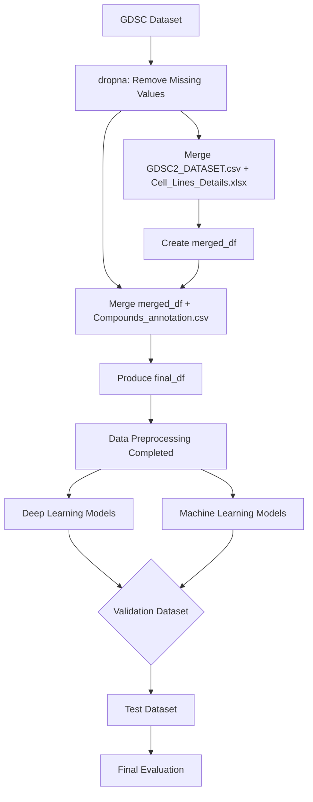

# Kaggle_Genomics-of-Drug-Sensitivity-in-Cancer

[](https://opensource.org/licenses/MIT) [](https://www.python.org/) [](https://pytorch.org/)

[Dataset url](https://www.kaggle.com/datasets/samiraalipour/genomics-of-drug-sensitivity-in-cancer-gdsc/data)

[Our slides](https://github.com/andrew76214/Kaggle_Genomics-of-Drug-Sensitivity-in-Cancer/blob/main/slides.pdf)

## Table of Contents
- [Introduction](#introduction)
- [Dataset Overview](#dataset-overview)
- [Dataset EDA](#dataset-eda)
- [Data Preprocessing](#data-preprocessing)
- [Pipeline](#pipeline)
- [Models Implemented](#models-implemented)
- [Evaluation](#evaluation)
- [Experimental Record](#experimental-record)
- [Installation and Usage](#installation-and-usage)
- [Contributing](#contributing)
- [License](#license)
- [Contributors](#contributors)

## Introduction
The **Genomics of Drug Sensitivity in Cancer (GDSC)** project, a collaboration between the UK and USA, aims to systematically evaluate the sensitivity of human cancer cell lines to anti-cancer drugs. Key characteristics of the dataset include:  
- **Cell Viability Measurement**: Using the CellTiter-Glo assay after 72 hours of treatment.  
- **Target Variable**: `LN_IC50` – Represents the natural log of the drug concentration required to inhibit 50% of cell viability. Lower values indicate higher sensitivity to the drug.  

## Dataset Overview  

### Files Used  
- **GDSC2_DATASET.csv**: Drug sensitivity data for various cell lines.  
- **Cell_Lines_Details.xlsx**: Metadata for cancer cell lines.  
- **Compounds_annotation.csv**: Annotation details of the compounds used.  
- **GDSC_DATASET.csv**: Combined dataset merging the above three files.

## Dataset EDA
### Numerical Columns Analysis
* **LN_IC50**: The primary target variable.
* AUC
* Z_SCORE

<div align="center">
  
  
</div>

### Categorical Columns Analysis
* Microsatellite instability Status (MSI)
* Screen Medium
* Growth Properties
* CNA
* Gene Expression
* Methylation

<div align="center">
  
</div>

We mapped these columns from text categories to numbers.
#### Heatmap
<div align="center">
  
  
</div>

## Data Preprocessing  

1. **Step 1: Handling Missing Values**  
   - Applied `dropna` to ensure data completeness.

2. **Step 2: First Merge**  
   - Merged `GDSC2_DATASET.csv` with `Cell_Lines_Details.xlsx` to form `merged_df`.

3. **Step 3: Second Merge**  
   - Merged `merged_df` with `Compounds_annotation.csv` to produce the final dataset: `final_df`.

## Pipeline



## Models Implemented  

### Machine Learning Models  
- **Linear Models**:  
  - Lasso Regression  
  - Ridge Regression  
  - ElasticNet Regression  
  - Linear Regression  

- **Decision Trees and Ensemble Models**:  
  - Decision Tree  
  - Random Forest  
  - HistGradientBoosting  
  - XGBoost  
  - LightGBM  

- **Instance-Based Learning**:  
  - K-Nearest Neighbors (KNN) Regression  

*Hyperparameters were optimized using GridSearchCV.*

### Deep Learning Models  
- **Multilayer Perceptron (MLP)**  
- **CNN + Transformer**  
- **BERT-based Models**:  
    - bert-base-uncased
    - roberta-base
    - microsoft/deberta-v3-base
    - microsoft/deberta-v3-large

---

## Evaluation
We use Mean Squared Error (MSE) as our performance metric.

<div align="center">
  
</div>

## Experimental Record
### Machine Learning Model leaderboard
- the tuning log is in /ML/tuning_log.md

<div align="center">
  
</div>

### Deep Learning Model leaderboard
<div align="center">
  
</div>

---
## Installation and Usage

### Prerequisites
- Python 3.8+
- Required Python libraries listed in `requirements.txt`.

### Installation
1. Clone the repository:
   ```bash
   git clone https://github.com/andrew76214/Kaggle_Genomics-of-Drug-Sensitivity-in-Cancer.git
   cd Kaggle_Genomics-of-Drug-Sensitivity-in-Cancer
   ```
2. Install dependencies:
   ```bash
   pip install -r requirements.txt
   ```

### Usage
Run the EDA script:
```bash
python DatasetEDA.py
```
Run a specific machine learning or deep learning model:
```bash
python ML/main_ML.py
python DL/main_DL.py
```

## Contributing
Contributions are welcome! Please follow these steps:
1. Fork the repository.
2. Create a new branch:
   ```bash
   git checkout -b feature-branch
   ```
3. Commit your changes:
   ```bash
   git commit -m "Description of changes"
   ```
4. Push to the branch:
   ```bash
   git push origin feature-branch
   ```
5. Submit a pull request.

## License
This project is licensed under the MIT License - see the [LICENSE](LICENSE) file for details.

## Contributors

<div align="center">
  <a href="https://github.com/andrew76214/Kaggle_Genomics-of-Drug-Sensitivity-in-Cancer/graphs/contributors">
    
  </a>
</div>

Made with [contrib.rocks](https://contrib.rocks).
